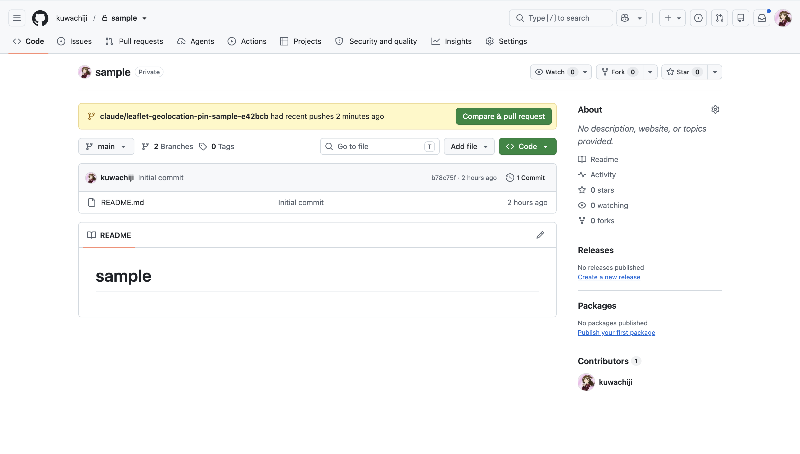
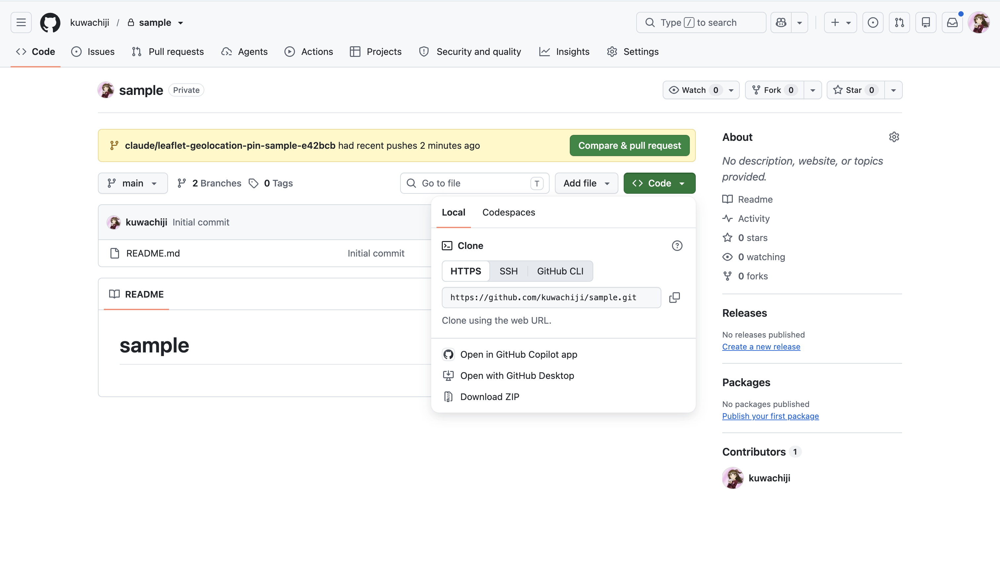

# 地図にピンを刺してみよう（Leaflet.js サンプル）

緯度・経度を指定して、地図上にピン（マーカー）を立てる練習用のサンプルです。
プログラミングが初めての人でも動かせるように、1つのファイルだけで完結しています。

教材（課題・参考サイト）は [TEXTBOOK.md](TEXTBOOK.md) にあります。

## ファイルを手に入れる

### git を使わない場合（おすすめ・アカウント不要）

GitHub のこのページから ZIP でまるごとダウンロードできます。

**1.** ファイル一覧の右上にある、緑の **Code** ボタンを押します。



**2.** メニューが開くので、いちばん下の **Download ZIP** を押します。



**3.** ダウンロードされた ZIP を解凍（ダブルクリック）します。

### git が使える場合

```bash
git clone https://github.com/kuwachiji/sample.git
cd sample
```

## 使いかた

**インターネットにつながっている必要があります**（地図の絵と Leaflet をネットから読み込むため）。

### まず試す：ダブルクリック

`index.html` をダブルクリックしてブラウザで開きます。
東京駅あたりの地図と3本のピンが出たら、それで準備完了です。
入力欄に緯度・経度を入れて「ピンを刺す」を押してみましょう。

地図が表示されない、画面が真っ白、といった場合は次へ進んでください。

### うまくいかないとき：簡易サーバーを立てる

ブラウザには「パソコンの中のファイルを直接開いたとき」の安全上の制限があり、
環境によってはダブルクリックでは動きません。下のようなエラーが出ることがあります。

```
Unsafe attempt to load URL file:///.../index.html from frame with URL file:///.../index.html.
'file:' URLs are treated as unique security origins.
```

このときは、`index.html` の入ったフォルダを簡易的なウェブサーバーとして公開してから開きます。
準備はいりません。Mac も Windows も、最初から入っているもので動きます。

**1.** `index.html` のあるフォルダをターミナル（Windows は PowerShell）で開きます。

- **Mac** … Finder でフォルダを右クリック →「フォルダに新規ターミナル」
  （出てこない場合は、ターミナルで `cd ` と打ってから、フォルダをウインドウにドラッグ＆ドロップ）
- **Windows** … エクスプローラーでフォルダを開き、上のアドレス欄に `powershell` と打って Enter

**2.** 下のコマンドを実行します。

Mac:

```bash
python3 -m http.server 8000
```

Windows:

```powershell
py -m http.server 8000
```

**3.** ブラウザで <http://localhost:8000/index.html> を開きます。

終わるときは、ターミナルで `Ctrl + C` を押すとサーバーが止まります。
ファイルを書きかえたときは、サーバーはそのままでブラウザを再読み込みするだけで反映されます。

> エディタに VS Code を使っているなら、拡張機能「Live Server」を入れて
> `index.html` を右クリック →「Open with Live Server」でも同じことができます。

## 緯度・経度の調べかた

- [Google マップ](https://www.google.com/maps) で場所を右クリックすると、
  `35.658581, 139.745433` のような数字が出ます。前が緯度、後ろが経度です。
- 日本はだいたい 緯度 24〜46 / 経度 123〜146 の範囲です。

試してみる例：

| 場所 | 緯度 | 経度 |
| --- | --- | --- |
| 東京タワー | 35.658581 | 139.745433 |
| 大阪城 | 34.687315 | 135.526201 |
| 札幌時計台 | 43.062660 | 141.353539 |

## コードを書きかえてみる

`index.html` をテキストエディタで開いて、`const pins = [` の部分を探してください。

```js
const pins = [
  { name: "東京駅", lat: 35.681236, lng: 139.767125 },
  ...
];
```

`name` が名前、`lat` が緯度（latitude）、`lng` が経度（longitude）です。

この行をまねして増やしたり、数字を変えたりすると、最初から出るピンが変わります。
書きかえたら保存して、ブラウザを再読み込み（リロード）してください。

## つまずいたときは

- **地図が真っ白**: CSS の `#map { height: 60vh; }` を消していませんか？
  地図を入れる箱には高さの指定が必要です。
- **ピンが出ない**: 緯度と経度を逆に入れていないか確認してみてください。
- **地図の絵が出ない**: インターネットにつながっているか確認してください。
- **「Unsafe attempt to load URL」と出る / ダブルクリックでは開けない**:
  [簡易サーバーを立てる](#うまくいかないとき簡易サーバーを立てる)を見てください。
- **`http://localhost:8000` を開いても表示されない**: サーバーを動かしたターミナルを
  閉じていませんか？ 閉じるとサーバーも止まります。開いたままにしておいてください。

## 使っているもの

- [Leaflet 1.9.4](https://leafletjs.com/) — 地図を表示するライブラリ
- [OpenStreetMap](https://www.openstreetmap.org/copyright) — 地図データ
